# InnovateSphere - Visual Diagrams & System Flows

## 1. HIGH-LEVEL SYSTEM ARCHITECTURE

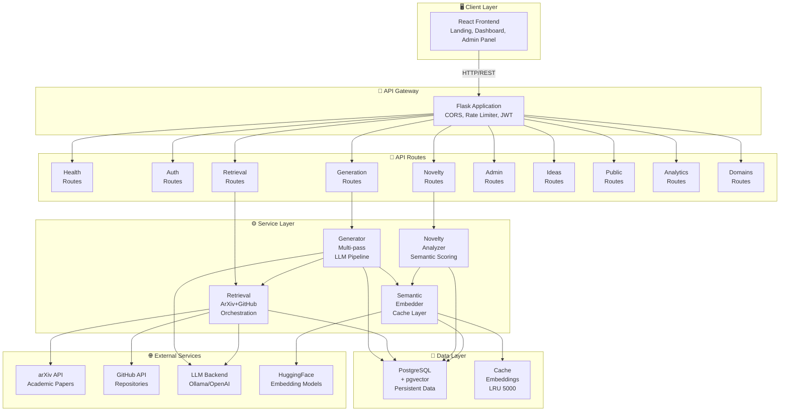

## 2. USER FLOW - IDEA EXPLORATION

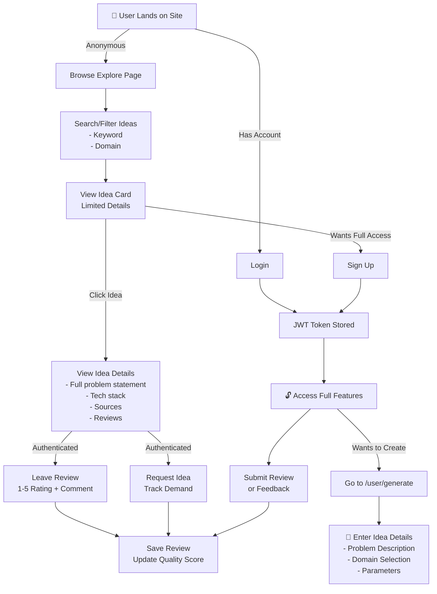

## 3. USER FLOW - IDEA GENERATION JOURNEY

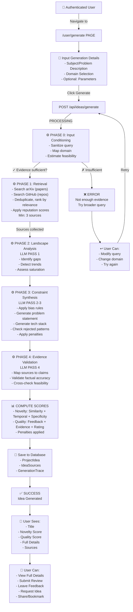

## 4. AI GENERATION PIPELINE - DETAILED

```mermaid
graph LR
    Query["🔤 User Query<br/>+ Domain"] -->|Condition| P0["📦 PHASE 0<br/>Input Prep"]
    
    P0 -->|Retrieve| P1["🔍 PHASE 1<br/>RETRIEVAL"]
    
    P1 -->|arXiv Search| ArXiv["academic<br/>papers"]
    P1 -->|GitHub Search| GHub["code<br/>repos"]
    
    ArXiv -->|deduplicate<br/>rank| Sources["✓ Top Sources<br/>3-20 results"]
    GHub -->|deduplicate<br/>rank| Sources
    
    Sources -->|Analyze| P2["🧠 LLM PASS 1<br/>LANDSCAPE"]
    
    P2 -->|Problem<br/>Formulation| P3a["🧠 LLM PASS 2<br/>PROBLEM"]
    
    P3a -->|Tech Stack<br/>Generation| P3b["🧠 LLM PASS 3<br/>SYNTHESIS"]
    
    P3b -->|with<br/>Constraints| Constraints["Bias Rules<br/>Admin Verdicts<br/>Domain Rules"]
    
    Constraints -->|constrained| P4["🧠 LLM PASS 4<br/>EVIDENCE"]
    
    P4 -->|validate| Result["✅ Final Idea<br/>Problem + Tech + Sources"]
    
    Result -->|analyze| Novelty["📈 Novelty Score<br/>Similarity + Temporal<br/>+ Specificity"]
    
    Result -->|compute| Quality["📈 Quality Score<br/>Feedback + Evidence<br/>+ Reviews"]
    
    Novelty -->|HITL| Penalties["⚠️ Penalties<br/>Admin feedback<br/>Source reputation"]
    
    Quality -->|HITL| Penalties
    
    Penalties -->|save| DB["💾 Store Idea<br/>+ Trace"]
    
    DB -->|deliver| User["👤 User Receives<br/>Scored Idea"]
```

## 5. NOVELTY SCORING ENGINE

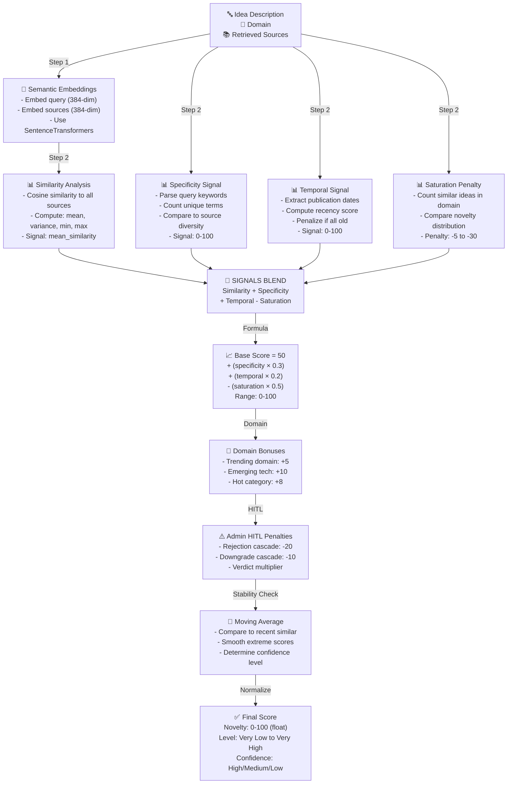

## 6. DATABASE ENTITY RELATIONSHIP

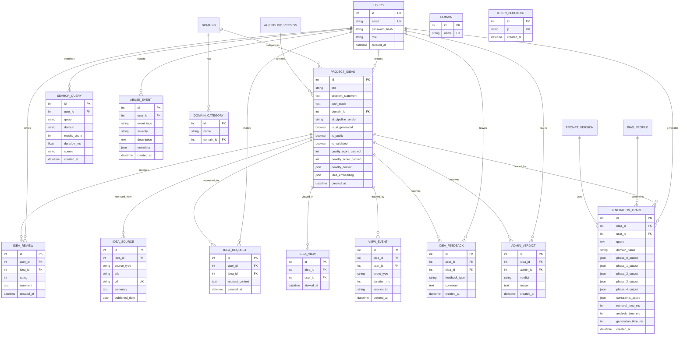

## 7. ADMIN REVIEW & HITL WORKFLOW

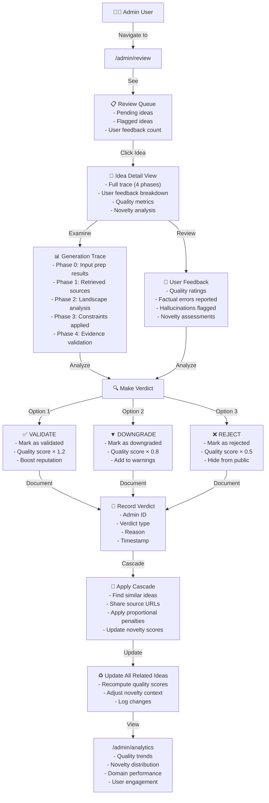

## 8. SOURCE RETRIEVAL ORCHESTRATION

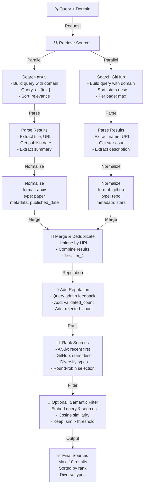

## 9. API REQUEST FLOW - GENERATION

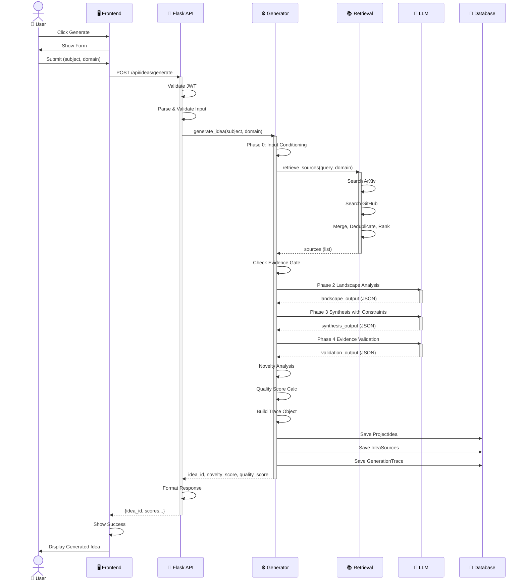

## 10. TECH STACK OVERVIEW

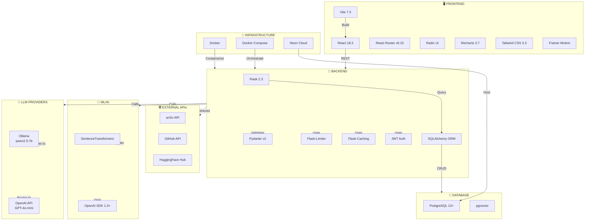

## 11. DEPLOYMENT ARCHITECTURE

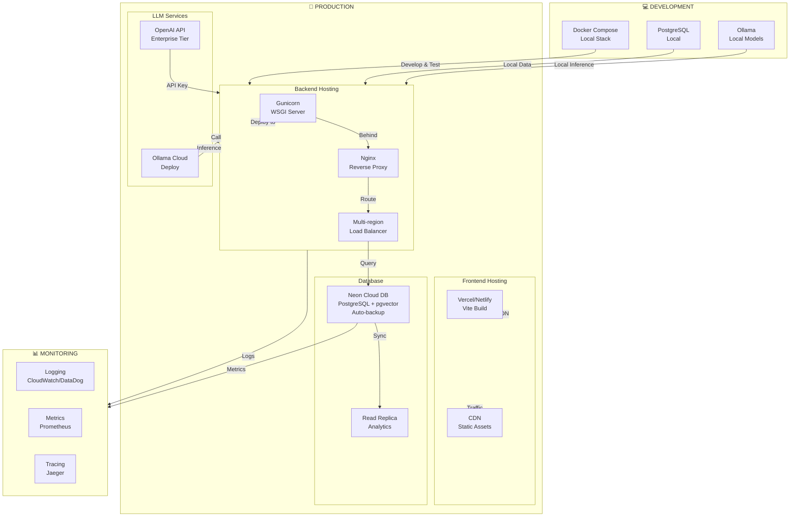

## 12. QUALITY & NOVELTY SCORE BREAKDOWN

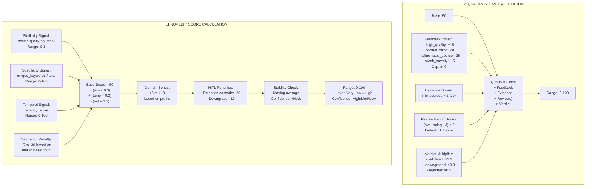

## 13. AUTHENTICATION & AUTHORIZATION FLOW

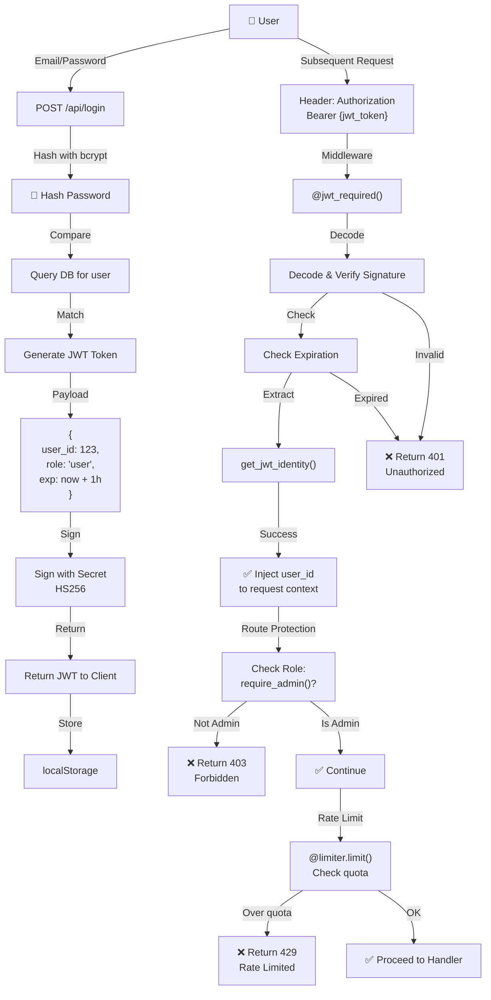

---

## Summary: Ready-to-Use Diagrams

✅ **1. System Architecture** - Component relationships
✅ **2. User Flow - Exploration** - Anonymous browsing journey  
✅ **3. User Flow - Generation** - Full idea creation process
✅ **4. Generation Pipeline** - 4-phase LLM workflow
✅ **5. Novelty Scoring** - Signal computation & blending
✅ **6. Database ERD** - Entity relationships & schema
✅ **7. Admin HITL** - Review & verdict workflow
✅ **8. Source Retrieval** - Multi-source orchestration
✅ **9. API Sequence** - Request/response flow
✅ **10. Tech Stack** - Dependency overview
✅ **11. Deployment** - Infrastructure layout
✅ **12. Score Calculation** - Quality & novelty formulas
✅ **13. Authentication** - Security & authorization

These diagrams are in Mermaid format and can be rendered in:
- GitHub (native markdown)
- Notion
- Confluence  
- Mermaid Live Editor (mermaid.live)
- Markdown editors with Mermaid support
- Export as PNG/SVG for presentations
