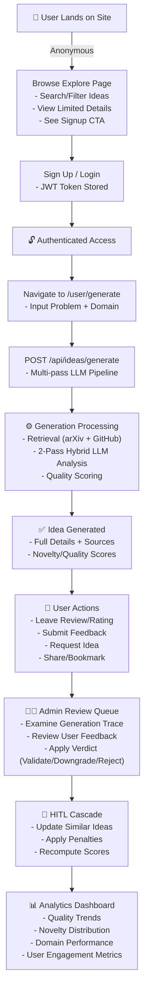
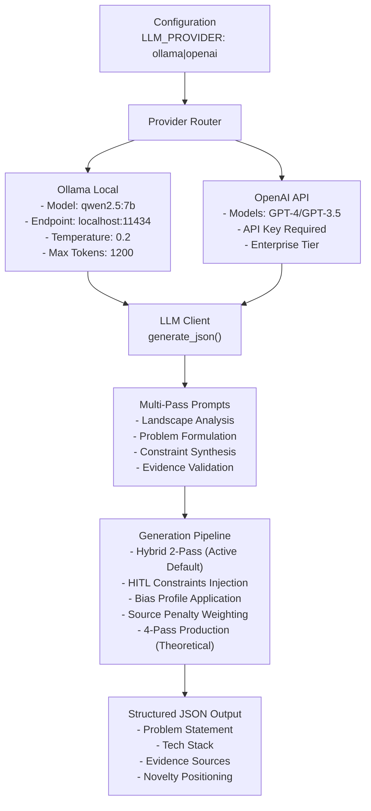
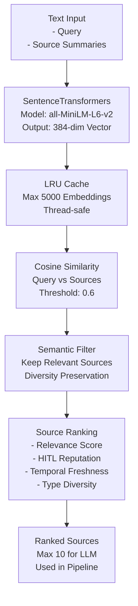
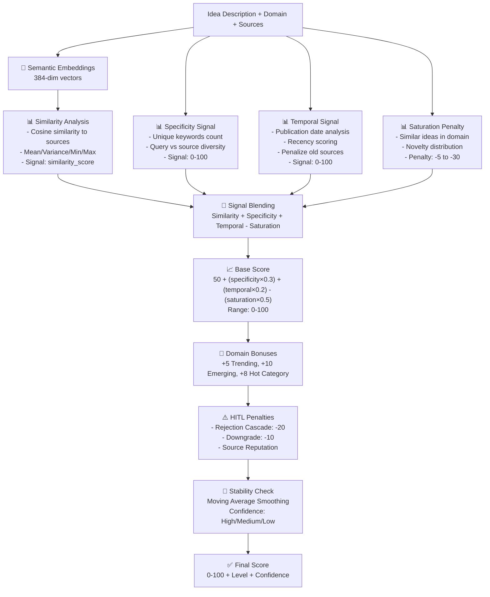
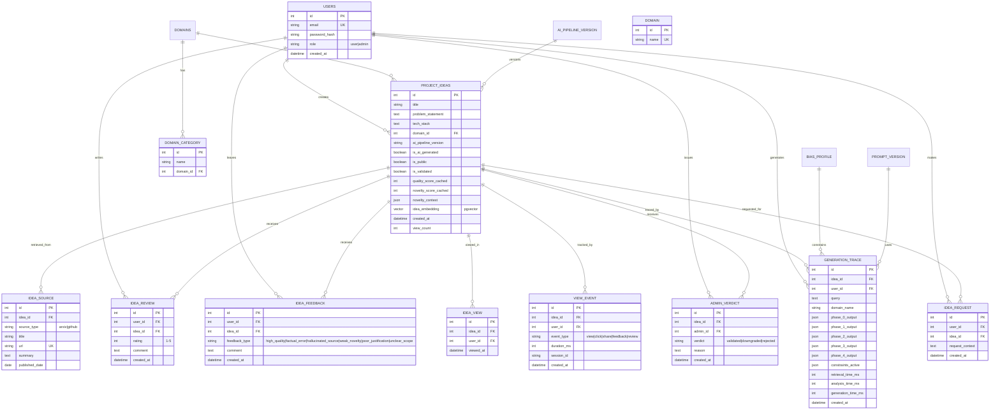
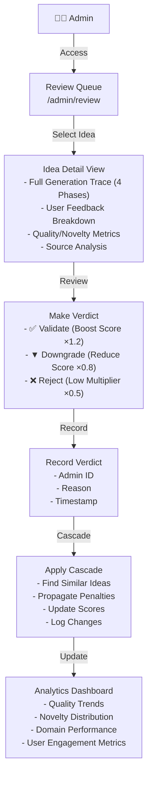

# InnovateSphere - Comprehensive Project Evaluation Context

## Executive Summary

InnovateSphere is an AI-powered full-stack web application for generating and exploring innovative project ideas. It combines semantic search, machine learning, multi-pass LLM pipelines, and human-in-the-loop (HITL) validation to help users discover unique project opportunities across various technology domains.

---

## 1. TECH STACK & DEPENDENCIES

### 1.1 Frontend Stack

| Component | Technology | Version | Purpose |
|-----------|------------|---------|---------|
| Framework | React | 18.2.0 | UI framework |
| Routing | React Router DOM | 6.22.3 | Client-side routing |
| HTTP Client | Axios | 1.12.2 | API communication |
| Build Tool | Vite | 7.3.1 | Dev server, HMR, production builds |
| Vite Plugin | @vitejs/plugin-react | 5.1.4 | React Fast Refresh |
| Styling | Tailwind CSS | 3.3.3 | Utility-first CSS |
| CSS Processing | PostCSS | 8.4.29 | CSS processing |
| Prefixing | Autoprefixer | 10.4.15 | Vendor prefixing |
| UI Primitives | Radix UI | (multiple) | Dialog, Dropdown, Select, Tabs, Toast, Tooltip, etc. |
| Animation | Framer Motion | 12.34.0 | Page transitions (user shell) |
| Icons | Lucide React | 0.564.0 | Primary icon set |
| Icons (alt) | React Icons | 5.5.0 | Supplementary icons |
| Charts | Recharts | 3.7.0 | Admin analytics charts |
| Toasts | Sonner | 2.0.7 | Toast notifications |
| Variants | Class Variance Authority | 0.7.1 | Component variant system |
| Class Utils | clsx + tailwind-merge | 2.1.1 / 3.4.0 | Conditional class merging |
| String Utils | leven | 4.1.0 | String distance computation |

### 1.2 Backend Stack

| Component | Technology | Version | Purpose |
|-----------|------------|---------|---------|
| Language | Python | 3.10+ | Primary language |
| Framework | Flask | 2.3.3 | Web framework |
| ORM | Flask-SQLAlchemy | 3.0.5 | Database ORM |
| Database | PostgreSQL | 13+ | Primary database |
| Vector Extension | pgvector | 0.3.4 | Vector similarity search |
| Adapter | psycopg2-binary | 2.9.7 | PostgreSQL adapter |
| Auth | Flask-JWT-Extended | 4.5.0+ | JWT token management |
| Password Hash | bcrypt | 4.0.1 | Password hashing |
| CORS | Flask-CORS | 4.0.0 | Cross-origin support |
| Caching | Flask-Caching | 2.1.0+ | Response caching |
| Rate Limiting | Flask-Limiter | 4.1.0+ | API rate limiting |
| Embeddings | Sentence Transformers | 2.2.2 | Text embeddings |
| Academic Search | arxiv | 1.4.4 | arXiv API client |
| HTTP Client | requests | 2.28.0+ | HTTP requests |
| Validation | Pydantic | 2.0.0+ | Data validation |
| Environment | python-dotenv | 1.0.0 | Environment variables |
| Numerical | NumPy | 1.26.4 | Numerical computing |
| HuggingFace | huggingface-hub | 0.20.3 | Model registry |

### 1.3 Infrastructure & External Services

| Component | Technology | Purpose |
|-----------|------------|---------|
| Containerization | Docker | Application containers |
| Orchestration | Docker Compose | Multi-container setup |
| Database Hosting | Neon (cloud PostgreSQL) | Cloud PostgreSQL with pgvector + pooler |
| Build Tool | Vite 7.3.1 | Frontend build, HMR, proxy |
| LLM Backend (Local) | Ollama | Local LLM inference (qwen2.5:7b) |
| LLM Backend (Cloud) | OpenAI API | GPT models (with fallback support) |
| Academic Sources | arXiv API | Research papers |
| Code Sources | GitHub API | Open source repositories |
| Embedding Models | HuggingFace | Pre-trained models (all-MiniLM-L6-v2) |

---

## 2. SYSTEM ARCHITECTURE

### 2.1 High-Level Architecture

```
┌─────────────────────────────────────────────────────────────┐
│                     CLIENT LAYER                             │
│  ┌──────────────────────────────────────────────────────┐  │
│  │  React Frontend                                       │  │
│  │  ├── Landing/Public Pages                            │  │
│  │  ├── User Dashboard & Profile                        │  │
│  │  ├── Idea Generation & Exploration                     │  │
│  │  ├── Admin Review Dashboard                          │  │
│  │  └── Novelty Analysis Viewer                         │  │
│  └──────────────────────────────────────────────────────┘  │
└─────────────────────────────────────────────────────────────┘
                            │
                    (HTTP/REST API)
                            │
┌─────────────────────────────────────────────────────────────┐
│                   API GATEWAY LAYER                          │
│  ┌──────────────────────────────────────────────────────┐  │
│  │  Flask Application                                   │  │
│  │  ├── CORS Handler                                    │  │
│  │  ├── Rate Limiter (Flask-Limiter)                    │  │
│  │  ├── JWT Authentication (Flask-JWT-Extended)         │  │
│  │  └── Request/Response Logging                        │  │
│  └──────────────────────────────────────────────────────┘  │
└─────────────────────────────────────────────────────────────┘
           │                    │                    │
    ┌──────┴─────┐      ┌──────┴─────┐       ┌──────┴──────┐
    │             │      │             │       │              │
┌───▼──────┐ ┌──▼───┐ ┌──▼────┐ ┌────▼──┐ ┌──▼──────┐ ┌────▼──┐
│ Retrieval│ │ Gen. │ │Novelty│ │Admin  │ │Analytics│ │Public │
│ Routes   │ │Routes│ │Routes │ │Routes │ │ Routes  │ │Routes │
└─────┬────┘ └──┬───┘ └───┬───┘ └────┬──┘ └────┬─────┘ └────┬──┘
      │         │         │          │         │            │
┌─────▼─────────▼─────────▼──────────▼─────────▼────────────▼────┐
│                    SERVICE LOGIC LAYER                         │
│  ┌──────────────┐  ┌─────────────┐  ┌──────────────────┐     │
│  │ AI Services  │  │Novelty      │  │Extraction        │     │
│  │ - Generator  │  │Analysis     │  │ - Source Parser  │     │
│  │ - LLM Client │  │ - Analyzer  │  │ - Domain Mapper  │     │
│  │              │  │ - Scoring   │  │                  │     │
│  └──────────────┘  └─────────────┘  └──────────────────┘     │
│                                                               │
│  ┌──────────────────┐  ┌─────────────┐  ┌────────────────┐   │
│  │Retrieval Engine  │  │ Semantic    │  │Cache Layer     │   │
│  │ - arXiv Client   │  │ - Embedder  │  │ - Embeddings   │   │
│  │ - GitHub Client  │  │ - Filter    │  │ - State        │   │
│  │ - Orchestrator   │  │ - Ranker    │  │                │   │
│  └──────────────────┘  └─────────────┘  └────────────────┘   │
└──────────┬─────────────────────────────────────────────────────┘
           │
┌──────────▼────────────────────────────────────┐
│         PERSISTENCE LAYER                     │
│  ┌──────────────────────────────────────────┐ │
│  │  PostgreSQL + pgvector Database          │ │
│  │  - Relational Data (Ideas, Users, etc)   │ │
│  │  - Vector Storage (Embeddings)           │ │
│  │  - Metadata & Relationships              │ │
│  └──────────────────────────────────────────┘ │
└───────────────────────────────────────────────┘
           │
┌──────────▼────────────────────────────────────┐
│    EXTERNAL SERVICES                          │
│  - arXiv API (academic papers)                │
│  - GitHub API (open source repos)             │
│  - Ollama / OpenAI (LLM backends)             │
│  - HuggingFace (embedding models)             │
└───────────────────────────────────────────────┘
```

### 2.2 Service Layer Components

| Module | Path | Responsibility |
|--------|------|----------------|
| **AI Module** | `backend/ai/` | LLM client, prompts, registry |
| **Generation** | `backend/generation/` | Multi-pass idea generator |
| **Retrieval** | `backend/retrieval/` | arXiv + GitHub orchestration |
| **Novelty** | `backend/novelty/` | Semantic scoring engine |
| **Semantic** | `backend/semantic/` | Embeddings, filtering, ranking |
| **Core** | `backend/core/` | Models, auth, config, database |

---

## 3. USER FLOW DIAGRAM

### 3.1 Complete User Journey



### 3.2 Frontend Page Structure

| Page | Route | Auth Required | Shell | Purpose |
|------|-------|---------------|-------|----------|
| Landing | `/` | No | PublicShell | Public overview, signup CTA |
| Explore | `/explore` | No | PublicShell | Browse public ideas |
| Login | `/login` | No | PublicShell | User authentication |
| Register | `/register` | No | PublicShell | User signup |
| Idea Detail | `/idea/:id` | No | PublicShell | View full details |
| User Dashboard | `/user/dashboard` | Yes | UserShell | User's ideas & stats |
| Generate | `/user/generate` | Yes | UserShell | Create new idea |
| Novelty | `/user/novelty` | Yes | UserShell | Analyze novelty |
| My Ideas | `/user/my-ideas` | Yes | UserShell | User's idea collection |
| Admin Review | `/admin/` or `/admin/review` | Admin | AdminShell | Review pending ideas |
| Admin Analytics | `/admin/analytics` | Admin | AdminShell | Platform analytics |
| Admin Abuse | `/admin/abuse` | Admin | AdminShell | Abuse event monitoring |
| Admin Idea Detail | `/admin/idea/:id` | Admin | AdminShell | Detailed admin idea review |

---

## 4. TECHNICAL WORKFLOW

### 4.1 Idea Generation Pipeline (4-Phase)

```mermaid
graph LR
    Query["🔤 User Query + Domain"] -->|Phase 0| P0["📦 Input Conditioning<br/>- Sanitize query<br/>- Map domain<br/>- Estimate feasibility"]
    
    P0 -->|Phase 1| P1["🔍 Retrieval<br/>- arXiv Search<br/>- GitHub Search<br/>- Deduplicate & Rank<br/>- Reputation Scoring"]
    
    P1 -->|Evidence Gate| Gate["✅ Min 3 Sources?<br/>Diverse Types?"]
    
    Gate -->|No| Error["❌ Error: Insufficient Evidence"]
    
    Gate -->|Yes| P2["🧠 LLM Pass 1<br/>Landscape Analysis<br/>- Identify Gaps<br/>- Spot Trends<br/>- Assess Saturation"]
    
    P2 --> P3["🧠 LLM Pass 2<br/>Problem Formulation<br/>- Generate Problem Statement<br/>- Initial Tech Stack"]
    
    P3 --> P4["🧠 LLM Pass 3<br/>Constraint Synthesis<br/>- Apply HITL Rules<br/>- Bias Profiles<br/>- Admin Verdicts<br/>- Source Penalties"]
    
    P4 --> P5["🧠 LLM Pass 4<br/>Evidence Validation<br/>- Map Sources to Claims<br/>- Validate Factual Accuracy<br/>- Cross-check Feasibility"]
    
    P5 --> Scoring["📊 Scoring<br/>- Novelty: Similarity + Temporal + Specificity<br/>- Quality: Feedback + Evidence + Reviews"]
    
    Scoring --> Persistence["💾 Persistence<br/>- Save ProjectIdea<br/>- Save IdeaSources<br/>- Save GenerationTrace<br/>- Create IdeaRequest"]
    
    Persistence --> Success["✅ Success<br/>Return Idea + Scores"]
    
    Error --> Retry["↩️ User Retry<br/>- Modify Query<br/>- Change Domain"]
```



### 4.2 API Endpoint Structure

| Endpoint | Method | Auth | Purpose |
|----------|--------|------|---------|
| `/api/health` | GET | No | System health check |
| `/api/domains` | GET | No | Domain taxonomy |
| `/api/public/ideas` | GET | No | Browse public ideas (cached) |
| `/api/public/ideas/<id>` | GET | No | Public idea detail |
| `/api/public/top-ideas` | GET | No | Top ideas |
| `/api/public/top-domains` | GET | No | Top domains |
| `/api/public/stats` | GET | No | Platform statistics |
| `/api/register` | POST | No | User registration |
| `/api/login` | POST | No | User login |
| `/api/refresh` | POST | Refresh token | Token refresh |
| `/api/logout` | POST | Yes | Logout (revoke token) |
| `/api/ideas/generate` | POST | Yes | Async idea generation |
| `/api/ideas/generate/<job_id>` | GET | Yes | Poll generation status |
| `/api/ideas/generate/<job_id>/stream` | GET | Token param | SSE progress stream |
| `/api/ideas/mine` | GET | Yes | User's own ideas |
| `/api/ideas/:id` | GET | Yes | Authenticated idea detail |
| `/api/ideas/:id/review` | POST | Yes | Submit/upsert review |
| `/api/ideas/:id/reviews` | GET | Yes | List reviews |
| `/api/ideas/:id/feedback` | POST | Yes | Submit feedback |
| `/api/ideas/:id/feedbacks` | GET | Yes | List feedbacks |
| `/api/ideas/:id/novelty-explanation` | GET | Yes (owner) | Novelty explanation |
| `/api/retrieval/sources` | POST | Yes | Retrieve sources |
| `/api/novelty/analyze` | POST | Yes | Analyze novelty |
| `/api/admin/ideas/quality-review` | GET | Admin | Review queue |
| `/api/admin/ideas/:id` | GET | Admin | Admin idea detail |
| `/api/admin/ideas/:id/verdict` | POST | Admin | Submit verdict |
| `/api/admin/ideas/:id/human-verified` | POST | Admin | Toggle human-verified |
| `/api/admin/ideas/:id/sources/:sid/hallucinated` | POST | Admin | Flag hallucination |
| `/api/admin/ideas/:id/generation-trace` | GET | Admin | View generation trace |
| `/api/admin/ideas/:id/bias-breakdown` | GET | Admin | Bias/penalty breakdown |
| `/api/admin/ideas/:id/rescore` | POST | Admin | Re-run novelty scoring |
| `/api/admin/abuse-events` | GET | Admin | View abuse events |
| `/api/analytics/admin/kpis` | GET | Admin | KPI dashboard |
| `/api/admin/domains` | GET | Admin | Domain statistics |
| `/api/admin/trends` | GET | Admin | 30-day trends |
| `/api/admin/distributions` | GET | Admin | Score histograms |
| `/api/admin/user-domains` | GET | Admin | User domain preferences |
| `/api/analytics/admin/bias-transparency` | GET | Admin | Bias impact analysis |
| `/api/ai/pipeline-version` | GET | No | Pipeline version |
| `/api/admin/review` | GET | Admin | Review queue |
| `/api/admin/idea/:id/verdict` | POST | Admin | Apply verdict |
| `/api/admin/analytics` | GET | Admin | View analytics |
| `/api/auth/login` | POST | No | Login |
| `/api/auth/register` | POST | No | Register |

---

## 5. AI ARCHITECTURE

### 5.1 LLM Integration



### 5.2 Embedding & Semantic Pipeline



### 5.3 Novelty Scoring Engine



---

## 6. DATABASE DESIGN (Neon MCP AI-Refactor Branch)

### 6.1 Entity-Relationship Diagram



### 6.2 Key Database Features

| Feature | Implementation | Purpose |
|---------|----------------|---------|
| **pgvector Extension** | Vector column type | Semantic similarity search |
| **Indexes** | domain_id, created_at, user_id | Query performance |
| **JSON Columns** | phase_*_output, constraints_active | Flexible schema for traces |
| **Unique Constraints** | email, url, user+idea+feedback_type | Data integrity |
| **Foreign Keys** | All relationships | Referential integrity |
| **Cached Scores** | quality_score_cached, novelty_score_cached | Performance optimization |

---

## 7. HITL (HUMAN-IN-THE-LOOP) WORKFLOW

### 7.1 Admin Review Process



### 7.2 Quality Score Calculation

```
Base: 50
+ Feedback Impact (capped at ±40):
  - high_quality: +15 per occurrence (max 3)
  - factual_error: -20 per occurrence
  - hallucinated_source: -25 per occurrence
  - weak_novelty: -15 per occurrence
  - poor_justification: -10 per occurrence
  - unclear_scope: -10 per occurrence
+ Evidence Bonus: min(sources × 2, 20)
+ Review Rating Bonus: (avg_rating - 3) × 2
× Verdict Multiplier:
  - validated: ×1.2
  - downgraded: ×0.8
  - rejected: ×0.5
= Final Quality Score (0-100)
```

---

## 8. CONFIGURATION & ENVIRONMENT

### 8.1 Key Configuration Variables

| Variable | Default | Description |
|----------|---------|-------------|
| `DATABASE_URL` | - | PostgreSQL connection string |
| `LLM_PROVIDER` | ollama | LLM backend (ollama/openai) |
| `LLM_MODEL_NAME` | qwen2.5:7b | Model name for generation |
| `OLLAMA_BASE_URL` | http://localhost:11434 | Local Ollama endpoint |
| `OPENAI_API_KEY` | - | OpenAI API key |
| `EMBEDDING_MODEL` | all-MiniLM-L6-v2 | Embedding model name |
| `EMBEDDING_DIM` | 384 | Embedding dimension |
| `SECRET_KEY` | dev-secret-key | Flask secret key |
| `JWT_SECRET_KEY` | dev-jwt-secret | JWT signing secret |
| `JWT_EXP_SECONDS` | 3600 | JWT expiration (1 hour) |
| `MAX_SOURCES_FOR_LLM` | 8 | Max sources sent to LLM |
| `MIN_EVIDENCE_REQUIRED` | 3 | Minimum sources for generation |
| `LLM_TIMEOUT_SECONDS` | 60 | LLM request timeout |
| `LLM_MAX_RETRIES` | 4 | LLM retry attempts |
| `CORS_ORIGINS` | http://localhost:5173 | Allowed CORS origins |
| `MAX_GENERATION_REQUESTS_PER_MIN` | 6 | Rate limit per minute |
| **LLM Safety** | | |
| `LLM_SAFETY_ENABLED` | true | Enable safety guardrails |
| `LLM_SAFETY_MAX_PROMPT_CHARS` | 5000 | Max prompt length |
| `LLM_SAFETY_BLOCKED_TOPICS` | weapons,... | Blocked topic list |
| **Fallback** | | |
| `LLM_FALLBACK_ENABLED` | true | Enable provider fallback |
| `LLM_FALLBACK_PROVIDER` | openai | Fallback LLM provider |
| `LLM_FALLBACK_MODEL` | gpt-4o-mini | Fallback model name |
| **Hybrid Mode** | | |
| `HYBRID_MODE_ENABLED` | false | Enable hybrid LLM mode |
| `HYBRID_LLM_TIMEOUT_SECONDS` | 90 | Hybrid mode timeout |
| `HYBRID_LLM_MAX_RETRIES` | 2 | Hybrid mode retries |
| **Demo Mode** | | |
| `DEMO_MODE_ENABLED` | false | Enable demo mode |
| `DEMO_LLM_TIMEOUT_SECONDS` | 45 | Demo mode timeout |
| `DEMO_LLM_MAX_RETRIES` | 1 | Demo mode retries |

### 8.2 Docker Compose Setup

```yaml
Services:
├── db (PostgreSQL 13 + pgvector)
│  ├─ Port: 5433
│  ├─ Volume: postgres_data (persistent)
│  └─ Environment: POSTGRES_USER, POSTGRES_PASSWORD, POSTGRES_DB
└── (Backend and Frontend run separately in dev)
```

---

## 9. SECURITY & PERFORMANCE

### 9.1 Security Measures

| Layer | Implementation |
|-------|----------------|
| **Authentication** | JWT with bcrypt password hashing |
| **Authorization** | Role-based access (user/admin) |
| **Rate Limiting** | Flask-Limiter (20 gen/hour, 100 req/hour) |
| **Input Validation** | Pydantic schemas, SQL injection prevention |
| **CORS** | Configured origins, preflight handling |
| **Abuse Detection** | Generation attempt tracking, auto-blocking |

### 9.2 Performance Optimizations

| Layer | Implementation |
|-------|----------------|
| **Embedding Cache** | LRU cache (5000 items) |
| **Response Caching** | Flask-Caching (5 min TTL) |
| **Database Indexes** | domain_id, created_at, user_id |
| **Connection Pooling** | SQLAlchemy pool_pre_ping |
| **Query Timeouts** | 5 second statement timeout |
| **Pagination** | limit + offset for all list endpoints |

---

## 10. MONITORING & OBSERVABILITY

### 10.1 Logging & Metrics

| Component | Implementation |
|-----------|----------------|
| **Request Logging** | Incoming requests, response times |
| **LLM Metrics** | API calls, retries, latency |
| **Novelty Telemetry** | Score computation, signal breakdown |
| **Database Timing** | Query execution times |
| **Cache Hit Rate** | Embedding cache efficiency |
| **Generation Traces** | Complete audit trail per idea |

### 10.2 Health Checks

| Endpoint | Purpose |
|----------|---------|
| `GET /api/health` | System health status |
| Database connectivity | Neon pooler check |
| LLM availability | Ollama/OpenAI status |

---

## 11. DEPLOYMENT ARCHITECTURE

### 11.1 Development Environment

```
Docker Compose:
├── db: PostgreSQL 13 + pgvector (port 5433)
├── backend: Flask dev server (port 5000)
└── frontend: Vite dev server (port 5173)

External:
├── Ollama: Local LLM (port 11434)
└── Neon: Cloud PostgreSQL (optional)
```

### 11.2 Production Environment

```
Frontend:
├── Vercel/Netlify: Vite production build
└── CDN: Static assets

Backend:
├── Gunicorn: WSGI server
├── Nginx: Reverse proxy
└── Multi-region: Load balancer

Database:
├── Neon: Cloud PostgreSQL + pgvector
└── Read Replica: Analytics queries

LLM:
├── Ollama Cloud: Local model hosting
└── OpenAI API: Fallback/primary
```

---

## 12. KEY FEATURES SUMMARY

| Feature | Description | Tech Implementation |
|---------|-------------|---------------------|
| **Idea Generation** | Multi-pass LLM pipeline | 4-phase generation with HITL constraints |
| **Novelty Analysis** | Semantic similarity scoring | SentenceTransformers + signal blending |
| **Quality Scoring** | HITL feedback aggregation | Feedback weights + admin verdicts |
| **Source Retrieval** | Dual search (arXiv + GitHub) | Parallel API calls with ranking |
| **Admin HITL** | Human review & verdicts | Cascade penalties to similar ideas |
| **User Engagement** | Reviews, feedback, requests | Full CRUD with analytics |
| **Semantic Search** | Vector similarity | pgvector + cosine distance |
| **Rate Limiting** | Abuse prevention | Flask-Limiter (in-memory) |
| **Generation Traces** | Complete audit trail | JSON storage of all phases |

---

## 13. ADDITIONAL RESOURCES

### Documentation Files
- `DIAGRAMS_MERMAID.md` - All Mermaid diagrams for visualization
- `PROJECT_ANALYSIS.md` - Detailed technical analysis
- `docs/ai_architecture.md` - AI-specific documentation
- `docs/frontend_design_admin.md` - Admin UI design
- `docs/frontend_design_user.md` - User UI design

### Scripts & Tools
- `scripts/comprehensive_test.py` - Full system testing
- `scripts/generate_smoke_test.py` - Quick generation test
- `scripts/test_novelty_*.py` - Novelty component tests
- `backend/scripts/migrations.py` - Database migrations
- `backend/scripts/seed_data.py` - Test data seeding

---

This comprehensive context provides all necessary information for creating:
- ✅ User Flow Diagrams
- ✅ System Architecture Diagrams
- ✅ Technical Workflow Diagrams
- ✅ AI Architecture Diagrams
- ✅ Database Design (Neon MCP AI-refactor branch)
- ✅ Deployment Architecture
- ✅ HITL Workflow Diagrams
